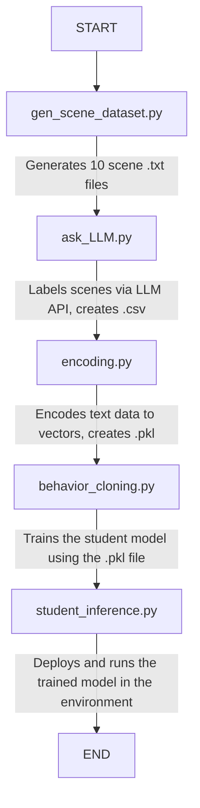

# MiniGrid Intelligent Agent: Learning LLM's Decision-Making via Behavioral Cloning

This project demonstrates a complete machine learning pipeline to train a lightweight intelligent agent (`StudentAgent`). The agent learns to mimic the high-level decision-making capabilities of a large language model (LLM), such as Google's Gemini, within the `MiniGrid` simulation environment.

The core of this project is **Behavioral Cloning** and **Knowledge Distillation**. We first use a powerful LLM as an "expert" to provide decision labels (e.g., "Explore" or "GoToExit") for various observed scenes. We then use this labeled dataset to train a small, efficient, local neural network—the "student model"—which learns to replicate the expert's behavior.

## Project Highlights

- **End-to-End Pipeline**: Covers the entire workflow, from data generation, AI-powered labeling, data preprocessing, and model training to final inference and application.
- **Knowledge Distillation**: Successfully "distills" the intelligence of a large, cloud-based model into a small, efficient local model.
- **Hierarchical Control**: Implements an agent design pattern that separates high-level strategy (decided by the neural network) from low-level actions (executed by simple rules).
- **Low-Cost Deployment**: The final model is fast, has a negligible runtime cost, and requires no internet connection, making it suitable for edge devices.

## Project Workflow

The project consists of a series of interconnected Python scripts that form a linear pipeline.

### Data Transformation Flow
`scene{i}.txt` → `subgoals_dataset.csv` → `subgoals_embeddings_minilm.pkl` → `student_agent.pt`
